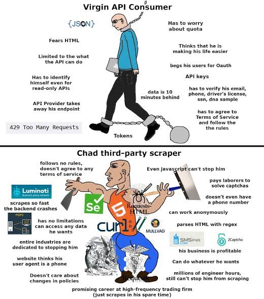

# YouTouIRC
An IRC bot to fetch data about Youtube links in Python 3.11.
# Setup
Assuming you have Python installed, go to the root of the project and create the virtual environment:
```bash
python -m venv env
```
Activate the virtual environment (this command is for POSIX systems with bash or zsh shell, see documentation for other platforms <https://docs.python.org/3/library/venv.html#how-venvs-work>):
```bash
source ./env/bin/activate
```
Then installed the dependencies:
```bash
pip install -r requirements.txt
```
The bot can be started with the following command (you can change config.ini to suit your needs):
```bash
irc3 config.ini
```
When you're done, run the following command to deactivate the environment:
```bash
deactivate
```

Always remember:

